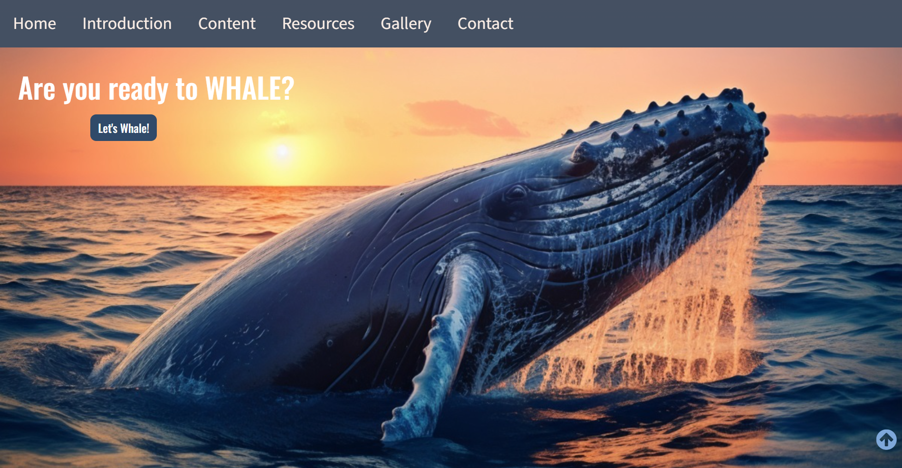
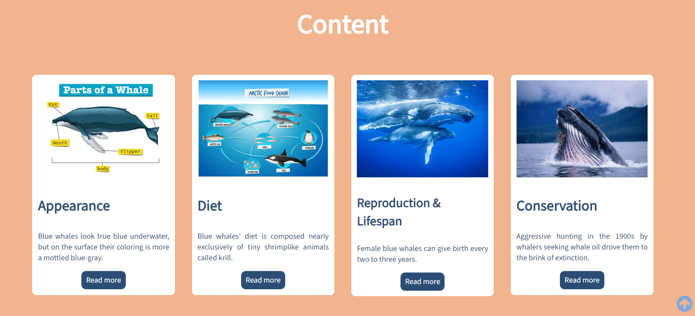
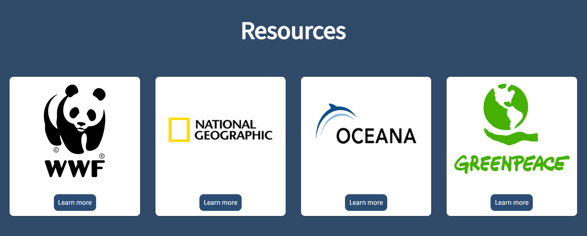
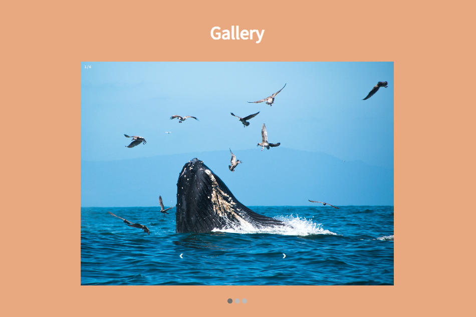
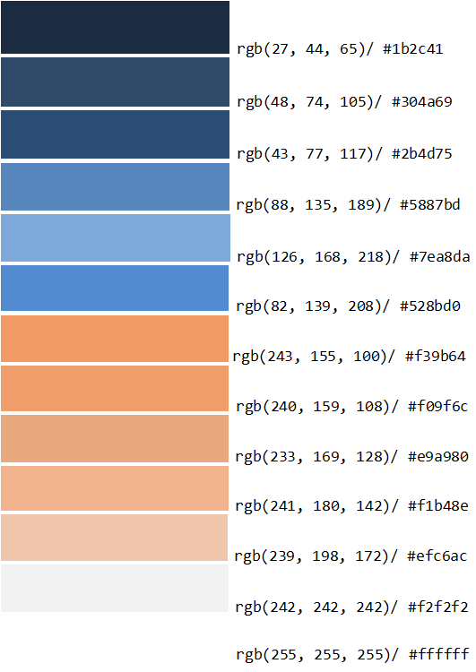

# Memoria del proyecto fin de evaluación de Lenguajes de Marcas - 1º DAW
## Whale with me

## Índice
- [Introducción](#introducción)
- [Motivación](#motivación)
- [Estructura](#estructura)
- [Estilo de la página](#estilo-de-la-página)
- [Snippets](#snippets)
- [Dónde visitar la página](#dónde-visitar-la-página)
- [Créditos](#créditos)

## Introducción
**Trabajo realizado por:** Ruyi Xia Ye  
**Proyecto de web "from scratch"** de la 1ª evaluación de Lenguajes de Marcas  
**Fecha:** Diciembre de 2023  
**Licencia:** Uso educativo con atribución

## Motivación
El tema lo he elegido porque al estar navegando por YouTube me salió un anuncio sobre las ballenas azules y mencionaba que era el animal más grande del planeta, lo que me pareció bastante interesante.

## Estructura
La web está dividida en 6 secciones:

**Hero Section**  
    
  Imagen de fondo adaptativa tomada de Freepik, diseño mobile-first. Incluye un Call to Action estilado con guía de W3Schools, enlazado a la sección Introduction.

**Introduction**  
    
  Grid de 2 columnas: una con texto introductorio, otra con vídeo de National Geographic enlazado desde YouTube.

**Content**  
    
  Grid de 4 columnas con cards estiladas, imágenes, texto breve y CTA "Read more".

**Resources**  
    
  Grid de 4 columnas con cards enlazadas a recursos externos mediante botones "Learn more".

**Gallery**  
    
  Galería tipo slideshow/carousel con imágenes de Freepik y Unsplash, basada en guía de W3Schools.

**Footer**  
  Grid de 2 columnas:
  - **Primera columna:**  
    Home, Introduction, Content, Resources, Gallery
  - **Segunda columna:**  
    - Contacto con email y botón "Donate"  
    - Redes sociales  
    - Modal de créditos con las fuentes usadas

## Estilo de la página

### Paleta de colores

### Tipografías
- Oswald regular  
- SourceSans3 regular

### Imágenes (Fuentes)
- Freepik  
- Unsplash  
- Oceanaadventures.co.za  
- Wallpapers.com  
- National Geographic (solo logo)  
- WWF (solo logo)  
- Greenpeace (solo logo)  
- Oceana.org (solo logo)

### Videos
Intro video from YouTube - National Geographic: [Ver video](https://youtu.be/bgiPTUy2RqI?si=t_d7_Hjced9KvPqE)

## Snippets
He utilizado los siguientes fragmentos de código de W3Schools:

- **Barra de navegación:**  
  [Responsive topnav](https://www.w3schools.com/howto/howto_js_topnav_responsive.asp)
- **Galería:**  
  [Slideshow gallery](https://www.w3schools.com/howto/howto_js_slideshow.asp)
- **Modal box para créditos:**  
  [Modal example](https://www.w3schools.com/howto/howto_css_modals.asp)

## Dónde visitar la página
Puedes ver el proyecto en funcionamiento en:  
🔗 [Enlace al sitio web desplegado](https://rxy94.github.io/whalewithme/)

## Créditos
Este proyecto ha sido realizado íntegramente por **Ruyi Xia Ye** como parte del módulo de **Lenguajes de Marcas** en 1º DAW.  
Todos los recursos visuales y fragmentos de código utilizados cuentan con licencia abierta o educativa, y se citan adecuadamente en este documento.
